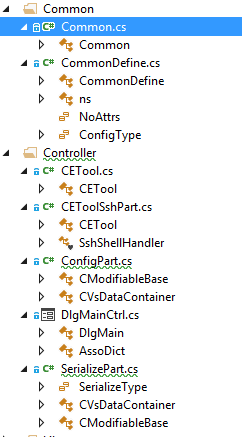
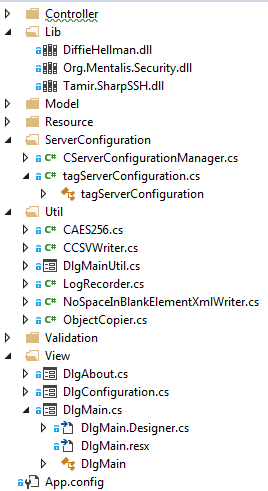
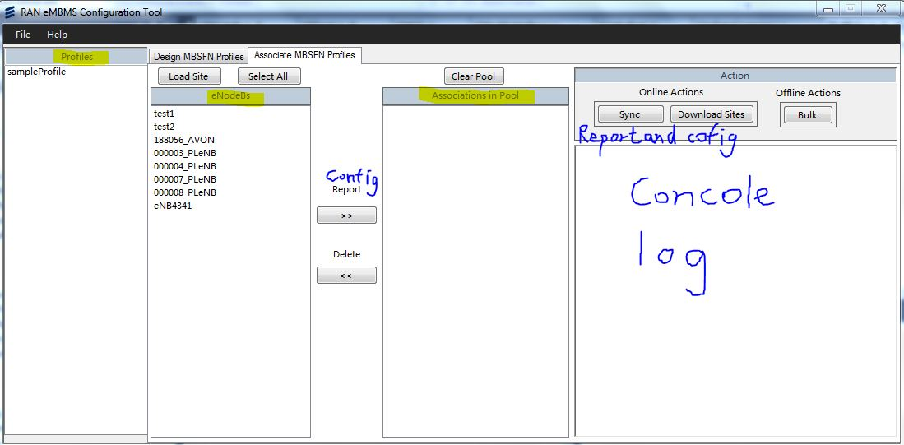
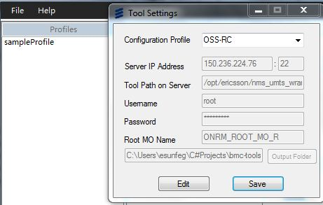

# ETool Design Proposal
> Author: Stupid Sun 
> Eid: esunfeg 		

***
###1. Aim
- This doc describes how requirements of ETool ’s requirements are comprehended and implemented.

- From 2015/8/3 to 2015/8/28, coded by Stupid Sun;

---
###2. Use Cases

####First of all, list of done jobs when I took over this project:

#####2.1. Import sites(eNodeBs):
- Click `load sites` and choose a csv file;
- User could only access OSS server and edited this file manually;
 
#####2.2. Load and Modify local profiles:
- View list of local profiles in GUI;
- Import a profile and view areas, pmchs, services and tmgis in a tree-structed GUI;
- Edit above data and save to a new profile or overwrite it;
- Profile are saved as a self-defined format with extension of “.pfl” ;

#####2.3. Bind profile and eNodeB to an association:
 
- Select a profile and several eNodeBs, click `>>` button to add them into association pool;

#####2.4. Report:
- When association pool is not empty and profiles are “Report”, click `Report` to get a report of the eNodeBs;

Program will:

- `Upload report filter file;`
- `Execute report command;` 
- `Download report result file;`
- `Read eNodeBs from report result file;`
- `Save their profiles into “eNodeBName.pfl“ to local machine;`

####The following jobs are to be done:

#####2.5.	Config:
- When association pool is not empty and profiles are not “Report”, click `Config` to config the eNodeBs with corresponding profiles;

Program should:

- `Report first and get eNodeBs `
- `Read profiles from “profileName.pfl”;`
- `Apply profiles on corresponding eNodeBs to get modified data, let’s call it deltas.`
- `Save deltas to “Lock*.xml” and upload it and execute lock and active command;`
- `Save deltas to “Config*.xml” and upload it and execute config and active command;`
- `Save deltas to “Unlock*.xml” and upload it and execute unlock and active command;`

#####2.6.	Download sites(eNodeBs)
- When using OSS is real, click `download sites` to download eNodeBs from OSS server:

Program should:

- `Upload eNodeB list filter file `
- `Execute report command `
- `Download report result file;`
- `Read eNodeBs from report result file `
- `Add  their ids to GUI and save them on disk;`

***
###3.	Alternatives
- To satisfy above use cases, I considered the previous design and thought out some alternatives:
- Green ones were used at last
- Red ones were studied and tried but failed.

####3.1. Considering the business model, C/S should be more suitable.
- Reinvent the wheel in my familiar architecture maybe faster, stronger and easier.

####3.2. The “pfl” format sucks. Save xml files just as xml files.
- We only need a transfer between xml files to our models.
<table style="margin-left:27px">
  <td>xml files</td>
  <td style="border:0px"><==></td>
  <td>data model</td>
  <td style="border:0px;"><=X=></td>
  <td>pfl files</td>
</table>

####3.3. Use data models generated from xsd files to auto serialize and deSerialize XML files
<table style="margin-left:27px">
  <td>xsd files</td>
  <td style="border:0px">=auto=></td>
  <td>data model</td>
  <td style="border:0px"><=auto=></td>
  <td>xml files</td>
</table>

####3.4. Use Generic classes to refactor data models to make serialize and deSerialize to be easier

***
###4.	Class Sketch Diagram
- Data models’ class diagram is shown above.
Other structures can be seen from below pictures:

      
      

***
###5. Sequence Diagram
####5.1. Sync: 
    ETool.Sync:{
      Report: {
          uploadFilterFile,
          cmdReport: {
              excuteCmd: [
                  ConnectShell,
                  WriteLine(command),
                  SshShellExpect,
                  Regex.Match(result),
                  DisconnectShell
              ],
              downloadErrorLogFile
          },
          downloadReportFile,
          retrun: reportName
      },
      ParseReportFile(reportName): {
          readENodeBs,
          WriteProfile,
          applyProfile,
          return: configs
      },
      deleteNoDeltaENodeBs(configs),
      Config(Lock): {
          saveConfig(configs),
          uploadConfigFile,
          cmdConfig: {
              excuteCmd,
              downloadErrorLogFile
          },
          cmdActivate
      },
      Config(Config),
      Config(Unlock)
    }
#### 5.2. Serialize ###
    CModifiable.Serialize: {
      addHeadAttributes(),
      addComponents: {
        addnewXElement(_strComponents),
        add_modComponents.Serialize()
      }
    },
    CVsDataContainer.Serialize: {
      CModifiable.Serialize(),
      vsDataXElement(),
      dataContainerAddElements: {
        dataContainer.addComponents()
      },
      addConfigAttribute()
    },
    CAnyOtherModel.Serialize: {
      Overrided or original workflow of above two base classes
    }

#### 5.3. DeSerialize  ###
    CModifiable.DeSerialize: {
      name=elementLabelName(element),
      DeSerializeComponent(name): {
        if(element.HasElements){
          ctor=getDefaultCtorByClass(name),
          mod=ctor.Invoke(...),
          mod.DeSerialize(element),
          addModifiable(mod)
        }else{
          addStrComp(element)
        }
      }
    },
    CVsDataContainer.DeSerialize: {
      dataContainer.DeSerialize(element),
      CModifiable.DeSerialize(element.Element(nameSpace+labelName));
    },
    CAnyOtherModel.DeSerialize: {
      base.DeSerialize:{
        //Overrided or original workflow of above two base classes
      }
    }

#### 5.4. Minus/Delta ###

    CModifiableBase.CModifiableBase[
      newMod,
      oldMod
    ]: {
      componentKeys.forEach(key){
        if(keyisstrKey){
          strList=mod.strComp(key),
          if(newStrList!=oldStrList){
            strComp(newStrList)
          }
        }else{
          modList=mod.modifiables(key),
          if(modList.hasIdentity()){
            updateAttributeModList(modList): {
              if(newModList!=oldModList){
                modifiables(newModList)
              }
            }
          }else{
            modDict=modList.toDictionary(),
            updateModDict(modDict): {
              modDict.forEach(mod){
                ctor=getConfigCtorByClass(key),
                if(newMod){
                  if(oldMod){
                    ctor=getUpdateCtorByClass(key),
                    mod=ctor.Invoke(update)
                  }else{
                    mod=ctor.Invoke(create)
                  }
                }else{
                  mod=ctor.Invoke(delete)
                },
                addModifiable(mod)
              }
            }
          }
        }
      }
    },
    CModifiableBase.CModifiableBase[
      newMod,
      modifier
    ]: {
      this.modifier=modifier,
      if(modifier==create){
        _strComponents=copy(newMod._strComponents),
        newMod.modifiableComponents.forEach(mod){
          ctor=getConfigCtorByClass(mod.laberName),
          mod=ctor.Invoke(create),
          addModifiable(mod)
        }
      }
    },
    CAnyOtherModel.CAnyOtherModel:{
      base.ctor:{
        //Overrided or original workflow of above two base classes
      }
    }

***    
### 6. Interface Description (required) 

#### 6.1. Interface-form

#### 6.2. Interface-association

#### 6.3. Interface-OSS
